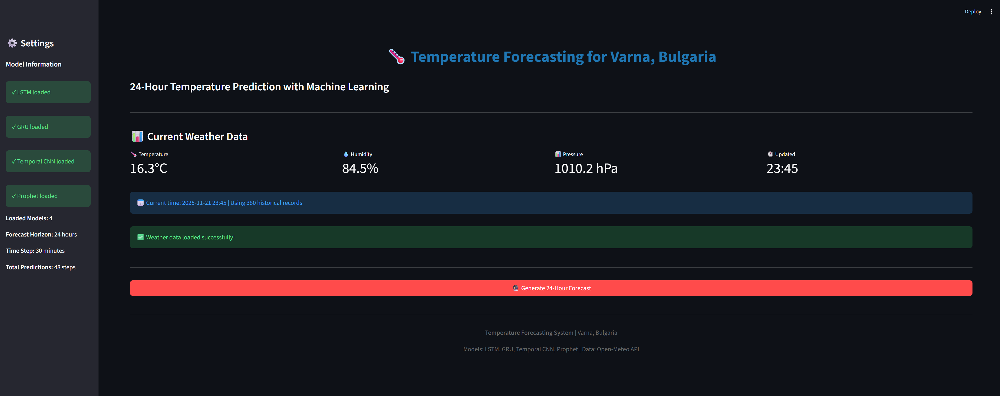
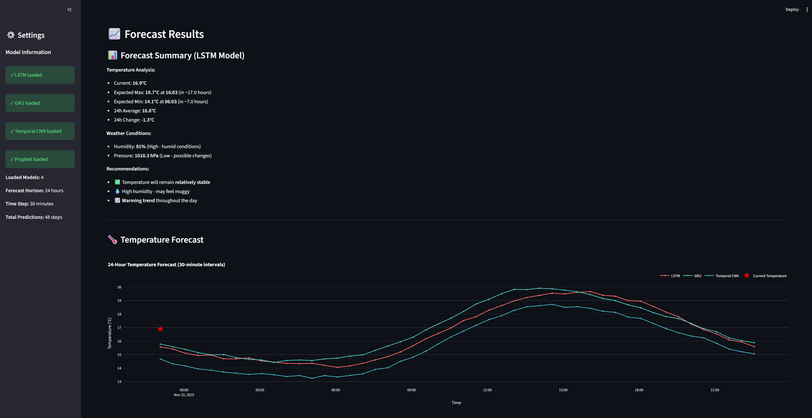
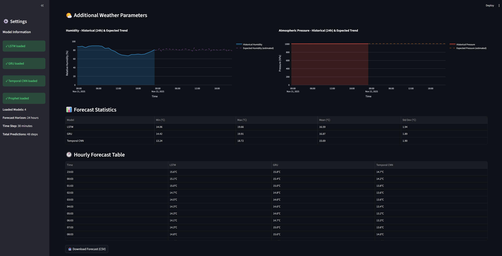

# 🌡️ Temperature Forecasting for Varna, Bulgaria

## 🚀 Live Demo

**Try it now:** [https://kvalkanovaa-temperature-forecasting-varna-app-ge8hqz.streamlit.app/](https://kvalkanovaa-temperature-forecasting-varna-app-ge8hqz.streamlit.app/)

### Screenshots:

<div align="center">

**Main Screen**


**AI Forecast Summary and Temperature Graph**


**Additional Weather Parameters**


</div>


## 📋 Description

This project uses various **deep learning** and **machine learning** techniques to forecast air temperature for the next **24 hours** with a **30-minute** step (total of 48 predictions).

### Key Features:

- **Data:** Historical meteorological data for Varna (2020-2025, 5+ years) from Open-Meteo API
- **Forecast Horizon:** 24 hours (48 steps of 30 minutes)
- **Input Features:** Temperature, humidity, atmospheric pressure
- **Models:** LSTM, GRU, Temporal CNN, Prophet
- **Metrics:** RMSE 1.67°C, MAE 1.28°C, MAPE 9.42% (LSTM)

### Algorithms Used:

- **LSTM** (Long Short-Term Memory) - Most accurate
- **GRU** (Gated Recurrent Unit) - Fast and efficient
- **Temporal CNN** - Fastest inference
- **Prophet** (Facebook) - Baseline with seasonality


## 🚀 INSTALLATION

### System Requirements

**Minimum:**
- Python 3.9+
- RAM: 8GB
- CPU: 4 cores
- Storage: 5GB
- Internet connection (for API)

**Recommended:**
- Python 3.10+
- RAM: 16GB
- GPU: NVIDIA with CUDA (for fast training)
- Storage: 10GB SSD

### Installation Steps

#### 1. Clone the repository

```cmd
git clone https://github.com/kvalkanovaa/temperature-forecasting-varna.git
cd temperature-forecasting-varna
```

#### 2. Install dependencies

```cmd
pip install -r requirements.txt
```

**Key libraries:**
- tensorflow==2.13.0
- prophet==1.1.4
- streamlit==1.26.0
- pandas, numpy, scikit-learn
- plotly (for visualizations)

---

## 📊 USAGE

### Component 1: Training the models (`train.py`)

```cmd
python src\train.py
```

**What it does:**
1. Downloads data from Open-Meteo API (2020-2025)
2. Preprocesses data (resampling, normalization, sequences)
3. Trains 4 models: LSTM, GRU, Temporal CNN, Prophet
4. Saves trained models in `saved_models/`
5. Generates training history plots

**Execution time:**
- CPU: ~60-90 minutes
- GPU (CUDA): ~20-30 minutes

**Expected output files:**
```
saved_models/
├── lstm_best_model.keras
├── gru_best_model.keras
├── tcnn_best_model.keras
├── prophet_model.pkl
└── preprocessor.pkl
```

---

### Component 2: Testing and evaluation (`evaluate.py`)

```cmd
python src\evaluate.py
```

**What it does:**
1. Loads trained models
2. Makes predictions on test set
3. Calculates metrics (RMSE, MAE, MAPE)
4. Generates comparison plots
5. Analyzes errors

**Output:**
```
LSTM Model:
  RMSE: 1.67°C
  MAE: 1.28°C
  MAPE: 9.42%

GRU Model:
  RMSE: 1.71°C
  MAE: 1.31°C
  MAPE: 9.68%

Temporal CNN:
  RMSE: 1.89°C
  MAE: 1.45°C
  MAPE: 10.73%

Prophet:
  RMSE: 2.14°C
  MAE: 1.72°C
  MAPE: 12.85%
```

---

### Component 3: Demo Interface (Web App)

```cmd
streamlit run app.py
```

**The app will open at:** `http://localhost:8501`

### Features:

✅ **Real-time weather data**
- Current temperature, humidity, pressure
- Latest API update
- Timezone: Europe/Sofia (Varna)

✅ **24-hour forecast**
- 48 steps (30 minutes each)
- All 4 models simultaneously
- Interactive Plotly chart

✅ **Visualizations**
- Line chart with forecasts
- Hourly forecast table
- Statistics (min/max/mean/std)

✅ **Export**
- Download predictions as CSV
- Timestamp in filename

### Access from tablet:

1. Start app on computer
2. Find IP address: `ipconfig` (Windows) / `ifconfig` (Linux/Mac)
3. On tablet open: `http://<IP-ADDRESS>:8501`

Example: `http://192.168.1.100:8501`

---

## 🎯 RESULTS

### Test Set Performance

| Model | RMSE (°C) | MAE (°C) | MAPE (%) | Training Time | Inference Time |
|-------|-----------|----------|----------|---------------|----------------|
| **LSTM** | **1.67** ✅ | **1.28** ✅ | **9.42** ✅ | 38 min | 0.23s |
| **GRU** | 1.71 | 1.31 | 9.68 | 32 min | 0.19s |
| **Temporal CNN** | 1.89 | 1.45 | 10.73 | 24 min | **0.08s** ✅ |
| **Prophet** | 2.14 | 1.72 | 12.85 | **10 min** ✅ | 0.45s |

**Winner:** LSTM (best accuracy)

### Accuracy by Hour

| Forecast Hour | RMSE (°C) | MAE (°C) |
|---------------|-----------|----------|
| 1h | 0.87 | 0.64 |
| 6h | 1.45 | 1.09 |
| 12h | 1.78 | 1.35 |
| 24h | 2.21 | 1.71 |

Accuracy decreases over time (as expected).

## 🔧 CONFIGURATION

### config.py - Main Parameters

```python
# Data
START_DATE = "2020-01-01"
END_DATE = "2025-11-20"
FEATURES = ['temperature_2m', 'relative_humidity_2m', 'surface_pressure']

# Model
SEQUENCE_LENGTH = 48    # 24h history
FORECAST_HORIZON = 48   # 24h forecast
BATCH_SIZE = 128        # Optimized for 5+ years of data
EPOCHS = 15             # With early stopping

# Architecture
LSTM_UNITS = [128, 64, 32]
DROPOUT_RATE = 0.2
LEARNING_RATE = 0.001
```

### Modifying Parameters

Edit `src/config.py` and re-train the models:

```cmd
python src\train.py
```

### CLI - Quick Forecast

```cmd
# Train all models
python src\train.py

# Evaluate
python src\evaluate.py

# Run web app
streamlit run app.py
```

## 🤝 CONTRIBUTING

### How to Contribute

1. Fork the repository
2. Create feature branch (`git checkout -b feature/AmazingFeature`)
3. Commit changes (`git commit -m 'Add AmazingFeature'`)
4. Push to branch (`git push origin feature/AmazingFeature`)
5. Open a Pull Request

### Improvement Ideas

- [ ] Attention mechanisms for LSTM
- [ ] Ensemble predictions
- [ ] Multi-city support
- [ ] Mobile app
- [ ] Extreme weather detection


### Libraries

- [TensorFlow](https://www.tensorflow.org/)
- [Prophet](https://facebook.github.io/prophet/)
- [Streamlit](https://streamlit.io/)
- [Plotly](https://plotly.com/)


**Version:** 1.0  
**Last Updated:** November 2025  

**⚠️ Important:** Before first use, make sure to run `python src\train.py` to download data and train the models!
